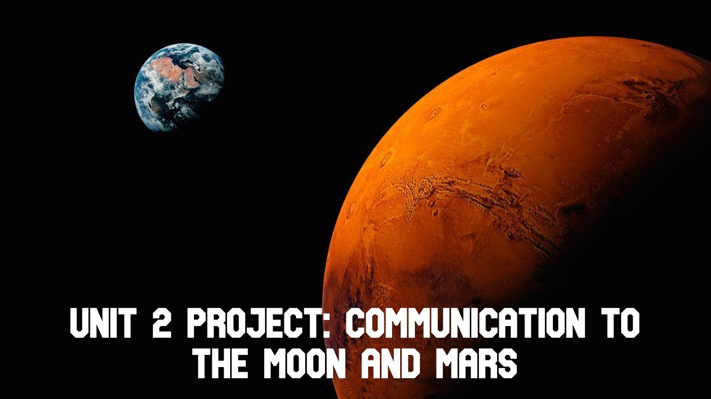

Unit 2 project: Communication to the Moon and Mars
==================================================

Creating a communication and translation software system to communicate between the earth, moon and mars.

Contents
-----
  1. [Planning](#planning)
  1. [Design](#design)
  1. [Development](#development)
  1. [Evalution](#evaluation)
  1. [Improvements](#improvements)

Planning
----------
### Definition of the problem

