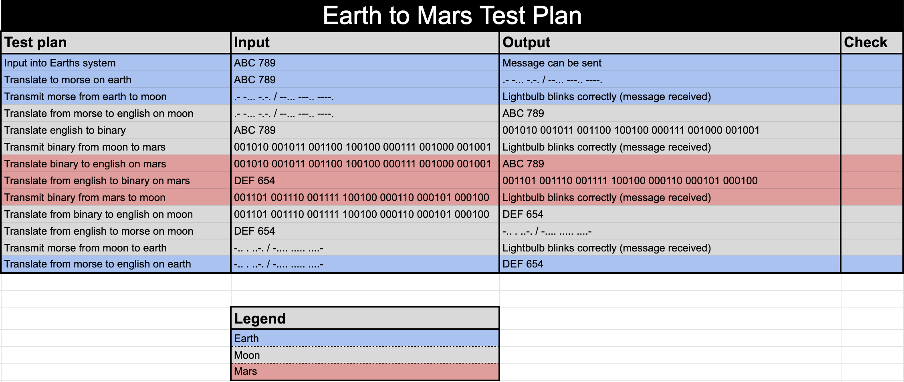
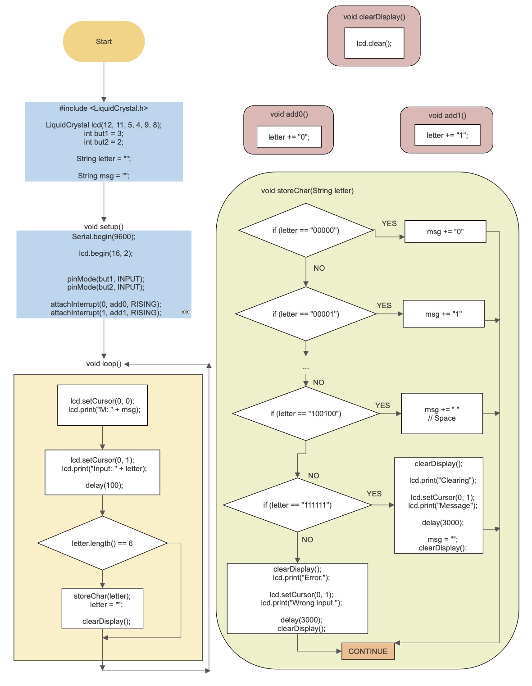
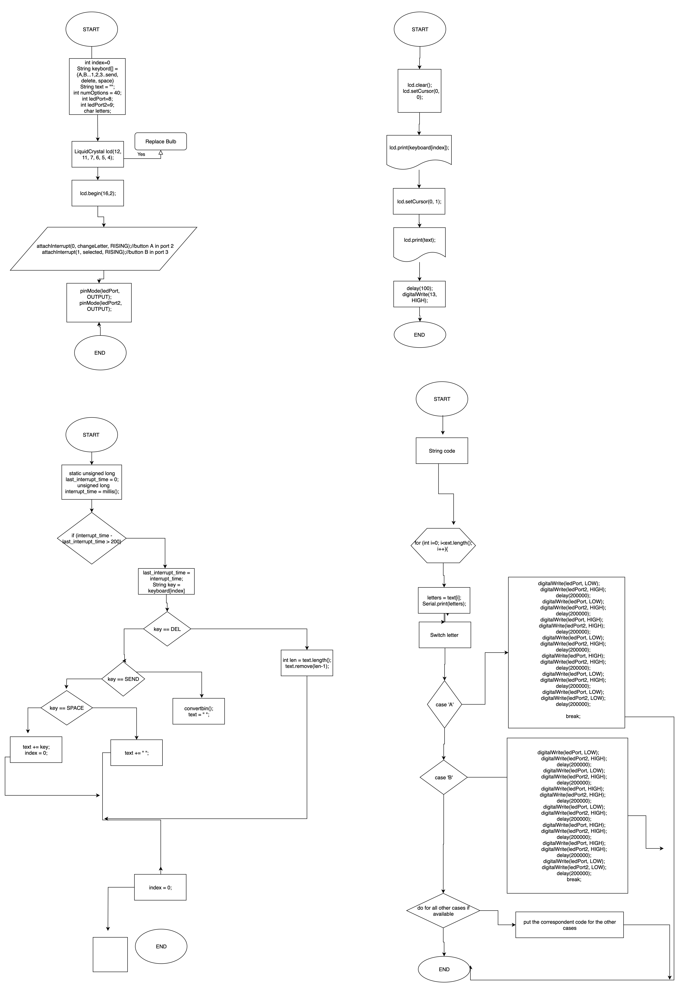
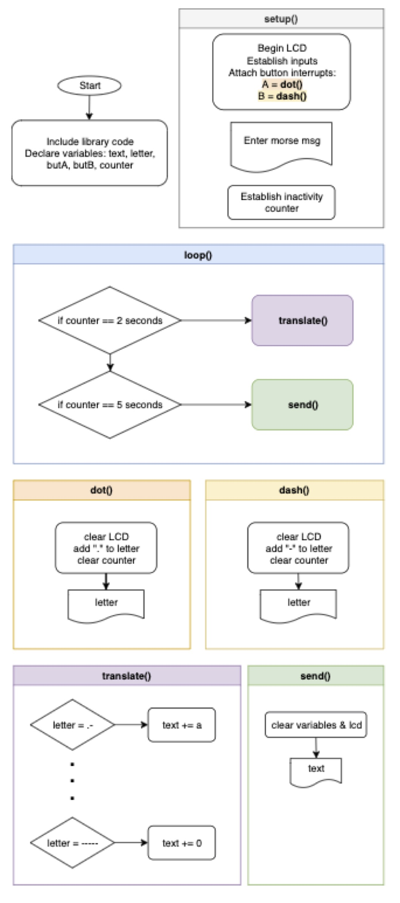
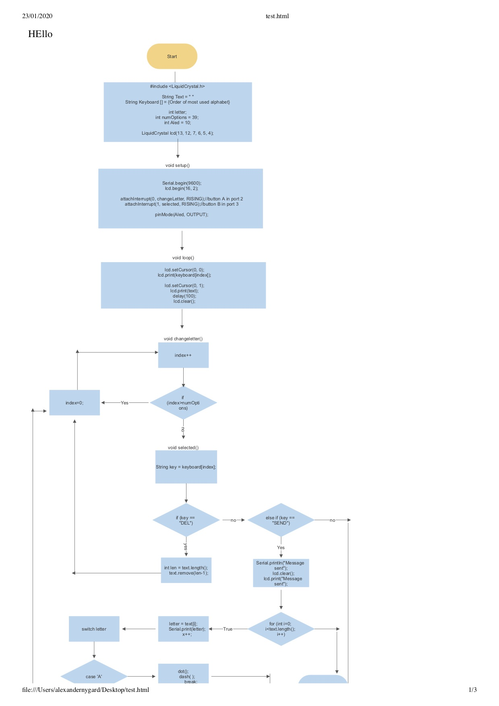
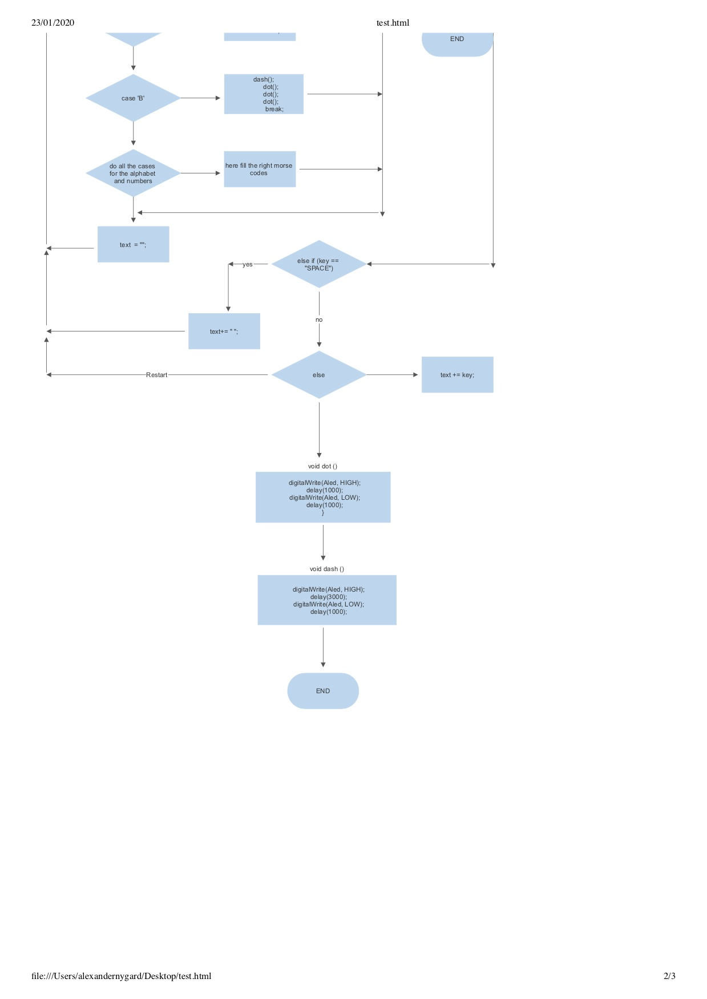
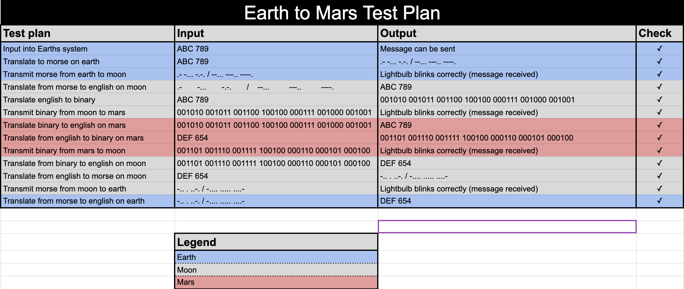

Unit 2 project: Communication to the Moon and Mars
==================================================

Creating a communication and translation software system to communicate between the earth, moon and mars.


Contents
-----
  1. [Planning](#planning)
  1. [Design](#design)
  1. [Development](#development)
  1. [Evalution](#evaluation)
  1. [Improvements](#improvements)


Planning
----------
### Definition of the problem
The problem can be described as follows: 
The client will be astronauts on the 3 different space-stations involved, each one being on a different planet/moon in our solar system. One is located on **Earth**, one is located on the **Moon** and the last one is located on **Mars**. The goal of this project is establishing a method of communication between the Earth and Mars. This scenario will be simulated here on campus, between 3 different houses.

The communication method is alse very limited between the 3 different stations. The station on Earth can *only* communicate with the station on the Moon through **morse code**, and the station on the Moon can *only* communicate with the stations on Mars and Earth through **binary code**. Any station can only communicate in their "language". Thus, the station on Mars must communicate back to the Moon through binary too. Also, its important that the station on Earth **can not** communicate with the station on Mars. It must go through the Moon. See [design](#design) section for more details about the design.

Another challenge is the fact that none of the clients/astronauts involved know morse or binary by heart, meaning all communication has to be translated to and from English, and be received as English as well.

The last requirement of the system is that the input method of English characters to create the message only uses **2 push buttons**.

### Solution
Our final product will be an interconnected system of 3 arduinos in 3 separate locations capable of both translation and transmission. Each "station" will have a functional arduino with 2 input buttons, for which the station can create a message (consisting of letters, numbers and " " space) and send to the desired destination (another station). The arduino will send that message through either radio contact or light pulses (representing either the binary or the morse). The translation structure will happen between english, morse and binary (see system diagram below, figure 2).

#### Justification

**Choosing Arduino**
As most programming languages, bash and the arduino (C) programming languages have many similarities and differences. There are plenty of pros and cons for both. For example, bash is highly useful for scripting, that is running code directly from the terminal to perform simple and repetitive tasks. This high level of integration in the terminal gives the user alot of control over the system being used. Bash also has a rich collection of tutorials and examples online, because it is so widely adopted. However, bash's syntax is quite unsatisfactory. It is rather unnecessarily complicated which often leads to errors for small mistakes of little relevance. The most important con, however, is that the bash language can only be run in specific environments, which do not include the arduino hardware. The arduino language, which is closely built upon the C programming language, on the other hand, also has its pros and cons. First of all, I must mention that C has almost become an industry standard, with it being recommended that every professional programmer has a good understanding of the language. The C language is also a bit lower level, meaning that it is closer to the computer hardware. That means that the programmer is required to deal with and learn about the low-level workings of a computer (memory management, pointers, etc.) Also, Cs relative simplicity and longevity have lead to it being very optimized and fast too. However, it is not nearly as simple syntax-wise compared to other very high level languages.

In conclusion, both these languages have many strong and weak sides. And frankly, it is qutie hard to compare because they serve different purposes, with bash being a shell environment and arduino C being a common and widespread programming language. Both function very well for their intended tasks, given that the programmer overcomes the learning barrier in regards to the syntax required. When choosing a language for this project, there was one obvious choice however; arduino C. The reason for this is the hardware requirements, functionality and usability. Using an arduino is a wise choice because of the rich documentation online, in addition to the relative cheap price with it still being very suitable for our small project.


To evaluate how successfull our solution is, a series a success criterias must be created. These are as follows:
1. The system is easy to install
1. The system has an simple to use user interface on all parts
1. Messages can be easily be input from English
1. The messages are translated flawslessly to morse and back
1. The messages are translated flawslessly to binary and back
1. The messages are transmitted flawlessly between the source and receiver - with no data loss

These points of success can be broken down into specific practical parts of the system functionality, thus the product can easily be evaluated. To evaluate the quality of this system, one must utilize a test plan to check the success criteria:


*Figure 1: Test plan with inputs and outputs*


Design
----------

A visualization of the flow of information and various stations looks like this:

*Figure 2: Visualization of the simulated stations.*

The system diagram for this project will be:

*Figure 3: A system diagram illustrating the communication between the stations. The arrows are color coded to represent the language in which the information is sent.*

The components included are marked by the pink number on the left, and are individually explained below:
1. The english string is the message that should be sent. A destination should also be specified
1. The input method is the 2 button character selector. This part is explained and documented in detail in the development section
1. At this stage, the english (with color green) message is translated into the relevant "language", depending on where the message will be sent
1. The message is sent and transmitted, and received by the relevant station
1. The message in either binary or morse form is translated back into english
1. The english message is received by the station

*Note: In some cases, the earth and mars will communicate between eachother, and prefer independant communication from the moon station. The message must be relayed via the moon, however the program on the moon could be altered to detect if the message is to be forwarded immediately, without reading it. In this case, the translated message from either mars or the earth (in english, received by the moon), could be used as an input from the moon and thus sent to the relevant party.*


This program will be created with two principles in mind - **Usability** and **Human Centered Design**

#### Definition of usability
1. Usability is *"the fact of something being easy to use, or the degree to which it is easy to use"* [1]
1. Usability is *"the degree of ease with which products such as software and Web applications can be used to achieve required goals effectively and efficiently. Usability assesses the level of difficulty involved in using a user interface. Although usability can only be quantified through indirect measures and is therefore a nonfunctional requirement, it is closely related to a product's functionality."* [2]

#### Definition of HCD (Human Centered Design)

According to Wikipedia.com, Human Centered Design is *"an approach to interactive systems development that aims to make systems usable and useful by focusing on the users, their needs and requirements, and by applying human factors/ergonomics, usability knowledge, and techniques. This approach enhances effectiveness and efficiency, improves human well-being, user satisfaction, accessibility and sustainability; and counteracts possible adverse effects of use on human health, safety and performance."* [3]

Another source describing this process being put to use first-hand can be found from source [4] . This source especially discusses the principles of desing, including discoverability and feedback.

Development
----------

The most important and challenging part of the development is the translation, inbetween English, morse and binary. Before this task can be accomplished, it is important to understand the essence of both morse and binary communication, which I have broken down in progressive steps.


### Communication with binary.
According to Wikipedia, binary *"is a number expressed in the base-2 numeral system or binary numeral system, which uses only two symbols: typically "0" (zero) and "1" (one)*".

Each digit is referred to as a *bit*.
* Using 1 bit, you can display 2 numbers (0-1).
* Using 2 bits, you can display 4 numbers (0-3)
* Using 3 bits, you can display 8 numbers (0-7)
* Using 4 bits, you can display 16 numbers (0-15)
And so forth...

**To convert a number from binary to decimal, one must follow the steps described below:**
1. Write down the binary number
1. Multiply the LSB (Least significant bit - furthest to the right) with 2 to the power of the position number (meaning first bit = 2^1, second bit = 2^2, third bit 2^3 etc.)
1. Continue doing step 2 until reaching the MSB (most significant bit)
1. Add all these results together to find the decimal result


**To convert a number from decimal to binary, the flowchart below must be used. See figure 4:**

*Figure 4: Flowchart describing the process of converting the decimal number to binary. Note: This program prints the LSB (Least significant bit, to the far right) first.*


#### Counting to 31, with decimal input to binary output
The code below shows the conditional statements required to count from 0 to 31 with binary. The output (binary) is represented as lights either being on or off. The conditions are based on the concept of the base-2 binary counting system. 

If the remainder of the number divided by 2^1 is 1, the first light is on (the number is odd).
If the remainder of the number divided by 2^2 is greater than one ((2^2)/2 - 1), the second light is on.
If the remainder of the number divided by 2^3 is greater than 4 ((2^3)/2 - 1), the third light is on.
And so forth:

```.c
// Condition for the first led
if (i % 2 != 0) {
  digitalWrite(led1, HIGH);
}
// Condition for the second led
if (i % 4 > 1) {
  digitalWrite(led2, HIGH);
}
// Condition for the third led
if (i % 8 > 3) {
  digitalWrite(led3, HIGH);
}
// Condition for the fourth led
if (i % 16 > 7) {
  digitalWrite(led4, HIGH);
}
// Condition for the fifth led
if (i % 32 > 15) {
  digitalWrite(led5, HIGH);
}
```
This code illustrates that relationship between the bits and the remainder of the division (explained also above the code).

#### Visualising binary numbers with 7-segment display
Using a 7-segment display, it is much easier to understand and interpret a binary number or input.
The 7-segment display is essentially 7 separate LEDs which when combinated in specific ways create the illusion of decimal numbers. More can be read on https://en.wikipedia.org/wiki/Seven-segment_display

To create a 7 segment display:
Arrange 7 lights in the pattern shown in the picture below, inside the 7 different line segments. To find the output of each light, the binary input of the 3 buttons must be used to create logical equations for the output. The table in the picture shows the state (on/off) of each light for every number. The tables (K-map tables) are used to determine the equations for each light by using logic gates, that can later be implemented into the code. See figure 5 below for further details.

*Figure 5: The 7 parts of the 7 segment display, the table for the inputs/outputs and the K-map tables for the first 3 lights*

The code for the logic equations used in the lights for the 7 segment display is as follows. Light A, B and C directly correlate to the 
```.c
// Define the input as simpler variables
A = digitalRead(butA);
B = digitalRead(butB);
C = digitalRead(butC);

// Light A
digitalWrite(outA, B || (C && A) || (!C && !A));
// Light B
digitalWrite(outB, !A || (!B && !C) || (C && B));
// Light C
digitalWrite(outC, C || (!C && !B) || (A && B));
// Light D
digitalWrite(outD, (!C && !A) || (B && !C) || (B && !A) || (A && C && !B));
// Light E
digitalWrite(outE, (!A && !C) || (B && !C));
// Light F
digitalWrite(outF, (A && !B) || (A && !C) || (!C && !B));
// Light G
digitalWrite(outG, (!A && B) || (A && !C) || (A && !B));
```

The logical equations were found using the K-map tables. The first 3 tables are shown in figure X, with the associated equations. The only difference, and the way I converted from an equation to code, is the replacement of the **"+"** with a **||** and a **"\*"** with a **&&**.

The finished product is shown in figure 6:


*Figure 6: Gif showcasing the final result of the display. Here all the numbers 0-7 are showcased, more or less in order.*

#### Working with strings
While working on this project, I discovered that strings are in general not a part of the C programming language. Text in C is rather represented by character (char) arrays. However, the arduino extention of the C programming language has included code that makes working with text much easier. In the arduino language, strings are easily created and flexible to work with. An example of a coding challenge I met while working with strings was iterating through a string to get individual characters. A sample code of how this is done is as follows:
```.c
String text = "abcdefg"; // String is a special class/type in arduino C

// text.length() returns the length of the string text
for (int i = 0; i < text.length(); i++) {
  Serial.println(text[i]); // Prints the i-th character of the string, starting from index 0.
}
```
With the output being:
```.c
a
b
c
d
e
f
g
```

#### Using the LCD display
The LCD (Liquid Crystal Display) is a 16x2 character display (16 columns and 2 rows, see figure 7) that displays characters and numbers. It is enabled by a library of code that helps developers take advantage of the functionalities of the screen. This library is included into an arduino program with the `#include <LiquidCrystal.h>` term. To initialize the display, one must specify the 5 ports at which it connects (ex. `LiquidCrystal lcd(13, 12, 11, 10, 9, 8)`) and use the method `lcd.begin(16,2)` to specify the dimensions. The most common functionality of the screen, and the methods and functions we utilize is as follows.
* `lcd.setCursor(col, row)` - Sets the position at which text is printed. Columns and rows have a starting index of 0. Thus, (0,1) will put the cursor on the second row and ready to print text from the first character space.
* `lcd.print(text)` - Prints the given string to the display, which each character taking one of the 16 columns.
* `lcd.clear();` - Clears the display to the default blank screen.

Further official documentation on the library can be found [here](https://www.arduino.cc/en/Reference/LiquidCrystal).


*Figure 7: This photo shows the LCD display and its text-printing abilities.*

#### Input method to English
A part of the context of the problem was that the stations only knew English, thus they have to input their messages with the english alphabet. The input method is constrained to the user only having 2 buttons. Using those two buttons, a message would have to be crafted, and potentially containing all 26 letters, 0-9 digits, " " space and a send and delete action.

The buttons are labeled A and B.

* When **button A** is pressed, the selection in focus is changed, through a rotation in a list. 
* If **button B** is pressed, the character or action is selected, and catenated to the final word. 
“SEND” and “DEL” are actions. 

A central part of this program is a pre-made function accompanying the arduino programming language: `attachInterrupt()`
`attachInterrupt(PIN, FUNCTION, MODE)` executes a function when a change on the specified port takes place.
The function takes the three arguments
* PIN - The pin which registers an interruption. On the Arduino UNO, port 2 corresponds to the value 0 and port 3 corresponds to the value 1
* FUNCTION - The function to be executed when an interruption is detected
* MODE - Determines what type of interruption is required to trigger the function. These can be:
    - LOW to trigger the interrupt whenever the pin is low,
    - CHANGE to trigger the interrupt whenever the pin changes value
    - RISING to trigger when the pin goes from low to high
    - FALLING for when the pin goes from high to low


This function is implemented in the input program as follows:
```.c
void setup()
{
  Serial.begin(9600);
  attachInterrupt(0, changeLetter, RISING);//button A in port 2
  attachInterrupt(1, selected, RISING);//button B in port 3
}
```

In addition, it is essential to understand how the program deals with the action **SEND** and **DEL**. This part of the program is dealt with in the if/else if statement below. See figure 8 for the flowchart of the algorithm.


*Figure 8: Flowchart of the input using the 2 buttons. This flowchart handles the actions, and the default case (explained below)*

A snippet of the code looks like this:
```.c
// If DEL key is selected, remove last appended char to text
if (key == "DEL") {
  int len = text.length();
  text.remove(len-1);
} 
// If SEND is selected, reset the text variable to ""
else if (key == "SEND") {
  Serial.println("Message sent");
  text  = "";

} else {
  text += key; // Append char to message
}
```

When **DEL** is selected, `text.remove(len-1);` is executed. This removes the character on the index of the length of the word decremented by one (deletes the last added character).
When **SEND** is selected, `Serial.println("Message sent");` is executed and the message is "sent" (later improvements will ensure that the message is either displayed on an LCD or sent to another station). The variable `text` is also reset to an empty string. 
The **default case** is that the character in selection is appended to the string of the message (`text`).

#### Binary to english

*My main responsibility of this project was to create the Binary og English system.*

An essential part of this system is translating from binary to english, which will be how the moon and mars communicate between eachother. The stations will use light signals to communicate messages, which will have to be input manually by the user. This input will happen through the two buttons already used for the english input system (see previous section). One button will represent a 0, and one will represent a 1. The binary values will only require 6 bits to represent all the 37 characters, which include:

* Numbers 0-9 (000000-001001)
* Letters A-Z (001010-100011)
* Space " " (100100)

The program will continuously receive inputs from the user in form of button presses. When 6 bits are registered, the corresponding character is added to a final message string. To concatenate two strings in arduino C, one can simply use: `msg += "G";`.

Checking what character to add involves using 37 else if statements, with the first three using this structure:
```.c
if (character == "000000") {
  msg += "0";
} else if (character == "000001") {
  msg += "1";
} else if (character == "000010") {
  msg += "2";
```
It is important to note that the variable `msg` is of the type `String`, which is specific to the arduino variation of C. The ordinary C language does not include this type.

**The flowchart for this program is as follows in figure 9:**

*Figure 9: Shows the logical flow of the program that converts binary to english*

#### English to binary
This program was created by Kelven Kai, all credit goes to him.

The flowchart is as follows in figure 10:

*Figure 10: Flowchart for the english to binary translation*

#### Morse to English
This program was created by Lydia Etherington, all credit goes to her.

The flowchart is as follows in figure 11:

*Figure 11: Flowchart for the morse to english translation*

#### English to morse
This program was created by Chinomnso Okechukwu, all credit goes to him.

The flowchart is as follows in figure 12:


*Figure 12: Flowchart for the english to morse translation*


Evaluation
----------

To evalute the succcess of our solution and the implementation of this solution, one must re-examine the success criteria specified at the top of this repository. When examining these success criteria, it is also essential to consider the test plan which is located at the same location. After walking through the steps outlined in the test plan and conducting following the instructions in regards to the input, the desired output was achieved. The completed test plan including the check-list will therefore look as follows:



The evidence for this can be found in 5 different videos located in a Google Drive folder already shared with Dr. Pinzon.
The link can also be found [here](https://drive.google.com/drive/folders/1GP54CQTwInArqjo29mlwqzjRytWH70al?usp=sharing).

#### Issues with testing

While testing the various functionalities of the system, we encountered a few issues. While most of these were eventually resolved, I would nonetheless like to mention the problems and how we took action to fix them.

First of all, we had a severe issue with the input buttons. When pressing the buttons while conducting a test, it often occurred that the button behaved abnormally. For example, when pressing once, the arduino might not register a tap, or it might register 2 or 3 presses. This was extremely problematic, as it severely slowed down the testing process, while also rasing the level of irritation among me and my peers significantly. Some quick research explained that it was an issue originates from the construction of the button itself, and is referred to as *"bounciness"*. We found an article explaining the problem and a possible solution. Due to time constraints, we were not able to implement this solution. However, we managed to finish the testing regardless of the problem. A link with more information about this issue can be found [here](https://www.programmingelectronics.com/tutorial-19-debouncing-a-button-with-arduino-old-version/).

A second problem we encountered during the testing process was incompatibility of the various programs and arduinos. While developing our own code, we had failed to communicate at a high enough degree, such that for example the ports used on the arduinos were different, in addition to the ports specified in the code. Nonetheless, this did not cause too much trouble. Changing the ports of each individual program for multiple different arduinos worked well, however it was far from the ideal solution. Thus, a greater focus on cross-department communication next time would be beneficial.


Improvements
----------

There are several improvements that could be added to further better this system. These are a few suggestions of potential "upgrades", which I also believe to be quite realistic:

* Multiple light bulbs - An easy improvement to the system would be to add a lightbulb to the transmitting arduinos. This lightbulb could have multiple purposes, but would serve as a way to increase the rate of data transmission or make sure less data is lost. An example of a use case for an additional bulb could be using it as a reference timer, having it blink on or off every second. This is useful because to receive the information one must have a certain awareness of time. Both dots and dashes from morse and bits from binary all have a specific time length. Thus using an additional bulb to monitor the timing would help in understanding exactly the information that's been sent.

* Different transmission - The current method of transmission of information, blinking lights, is highly inefficient and very vulnerable for data loss. In addition, it is unrealistic when looking at the situation - astronauts would not send light signals between planets, it is done with radio waves. Thus, equipping the arduinos with powerful radio transmitters would improve range (further reach + able to transmit through obstacles, does not require clear path), reliability (less data loss, especially by eliminating the human factor), efficiency (more information per second), etc.

* Combining programs - At the current state, the software and code that runs the basic operations of our system (translation, transmission) are divided into separate individual programs. This is a disadvantage, because each station should only have one arduino. This means that when the functionality of the arduino needs to be switched (ex. from translating to transmission), the program must be reuploaded, costing valuable time. This problem could easily be avoided by combining the programs to create three master programs, one for each station (the stations would of course need to remain different). Thus, when switching on the arduino, the user could be prompted with a choice to choose either the translation functionality or the transmission functionality.


Bibliography

[1] : "Usability" from the Cambridge Business English Dictionary. Retrieved 25. Nov 2019 from https://dictionary.cambridge.org/dictionary/english/usability.
[2] : "Usability" from Techopedia. Retrieved 25. Nov 2019 from https://www.techopedia.com/definition/4919/usability.
[3] : "Human-centered design." Wikipedia contributors, Wikipedia, The Free Encyclopedia, last updated 3 Nov. 2019. Accessed 25. Nov 2019 from https://en.wikipedia.org/wiki/Human-centered_design.
[4] : Posner J, Mars R with VOX. "It's not you. Bad doors are everywhere." 26. Feb 2016. Retrieved 25. Nov 2019 from https://www.youtube.com/watch?v=yY96hTb8WgI.


