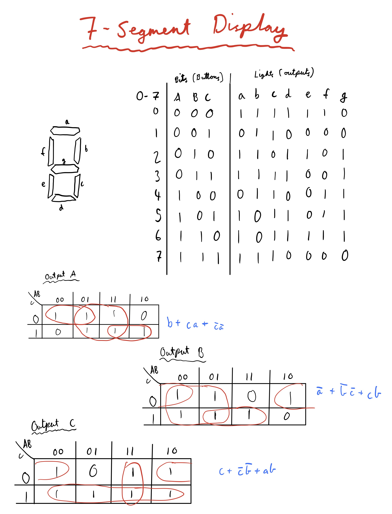

Unit 2 project: Communication to the Moon and Mars
==================================================

Creating a communication and translation software system to communicate between the earth, moon and mars.


Contents
-----
  1. [Planning](#planning)
  1. [Design](#design)
  1. [Development](#development)
  1. [Evalution](#evaluation)
  1. [Improvements](#improvements)


Planning
----------
### Definition of the problem
The problem can be described as follows: 
There are 3 different stations involved, each one being on a different planet/moon in our solar system. One is located on **Earth**, one is located on the **Moon** and the last one is located on **Mars**. The goal of this project is establishing a method of communication between the Earth and Mars. This scenario will be simulated here on campus, between 3 different houses.

The communication method is alse very limited between the 3 different stations. The station on Earth can *only* communicate with the station on the Moon through **morse code**, and the station on the Moon can *only* communicate with the stations on Mars and Earth through **binary code**. Any station can only communicate in their "language". Thus, the station on Mars must communicate back to the Moon through binary too. Also, its important that the station on Earth **can not** communicate with the station on Mars. It must go through the Moon. See [design](#design) section for more details about the design.

Another challenge is the fact that none of the people involved know morse or binary by heart, meaning all communication has to be translated to and from English, and be received as English as well.

The last requirement of the system is that the input method of English characters to create the message only uses **2 push buttons**. 

To evaluate how successfull our solution is, a series a success criterias must be created. These are as follows:
1. The system has an easy to use user interface on all parts
1. The messages are translated flawslessly between the languages
1. The messages are transmitted flawlessly between the source and receiver


Design
----------

A visualization of the flow of information looks like this:


Development
----------

The most important and challenging part of the development is the translation, inbetween English, morse and binary. Before this task can be accomplished, it is important to understand the essence of both morse and binary communication, which I have broken down in progressive steps.

#### Definition of usability
1. Usability is *"the fact of something being easy to use, or the degree to which it is easy to use"* [1]
1. Usability is *"the degree of ease with which products such as software and Web applications can be used to achieve required goals effectively and efficiently. Usability assesses the level of difficulty involved in using a user interface. Although usability can only be quantified through indirect measures and is therefore a nonfunctional requirement, it is closely related to a product's functionality."* [2]

#### Definition of HCD (Human Centered Design)

According to Wikipedia.com, Human Centered Design is *"an approach to interactive systems development that aims to make systems usable and useful by focusing on the users, their needs and requirements, and by applying human factors/ergonomics, usability knowledge, and techniques. This approach enhances effectiveness and efficiency, improves human well-being, user satisfaction, accessibility and sustainability; and counteracts possible adverse effects of use on human health, safety and performance."* [3]

Another source describing this process being put to use first-hand can be found from source [4] . This source especially discusses the principles of desing, including discoverability and feedback.


### Communication with binary.
According to Wikipedia, binary *"is a number expressed in the base-2 numeral system or binary numeral system, which uses only two symbols: typically "0" (zero) and "1" (one)*".

Each digit is referred to as a *bit*.
* Using 1 bit, you can display 2 numbers (0-1).
* Using 2 bits, you can display 4 numbers (0-3)
* Using 3 bits, you can display 8 numbers (0-7)
* Using 4 bits, you can display 16 numbers (0-15)
And so forth...

**To convert a number from binary to decimal, one must follow the steps described below:**
1. Write down the binary number
1. Multiply the LSB (Least significant bit - furthest to the right) with 2 to the power of the position number (meaning first bit = 2^1, second bit = 2^2, third bit 2^3 etc.)
1. Continue doing step 2 until reaching the MSB (most significant bit)
1. Add all these results together to find the decimal result


**To convert a number from decimal to binary, the flowchart below must be used:**


#### Counting to 31, with decimal input to binary output
The code below shows the conditional statements required to count from 0 to 31 with binary. The output (binary) is represented as lights either being on or off. The conditions are based on the concept of the base-2 binary counting system. 

If the remainder of the number divided by 2^1 is 1, the first light is on (the number is odd).
If the remainder of the number divided by 2^2 is greater than one ((2^2)/2 - 1), the second light is on.
If the remainder of the number divided by 2^3 is greater than 4 ((2^3)/2 - 1), the third light is on.
And so forth:

```.c
// Condition for the first led
if (i % 2 != 0) {
  digitalWrite(led1, HIGH);
}
// Condition for the second led
if (i % 4 > 1) {
  digitalWrite(led2, HIGH);
}
// Condition for the third led
if (i % 8 > 3) {
  digitalWrite(led3, HIGH);
}
// Condition for the fourth led
if (i % 16 > 7) {
  digitalWrite(led4, HIGH);
}
// Condition for the fifth led
if (i % 32 > 15) {
  digitalWrite(led5, HIGH);
}
```

#### Visualising binary numbers with 7-segment display
Using a 7-segment display, it is much easier to understand and interpret a binary number or input.
The 7-segment display is essentially 7 separate LEDs which when combinated in specific ways create the illusion of decimal numbers. More can be read on https://en.wikipedia.org/wiki/Seven-segment_display

To create a 7 segment display:
Arrange 7 lights in the pattern shown in the picture below, inside the 7 different line segments. To find the output of each light, the binary input of the 3 buttons must be used to create logical equations for the output. The table in the picture shows the state (on/off) of each light for every number. The tables (K-map tables) are used to determine the equations for each light by using logic gates, that can later be implemented into the code. See the image below for further details.

*Figure X: The 7 parts of the 7 segment display, the table for the inputs/outputs and the K-map tables for the first 3 lights*

The code for the logic equations used in the lights for the 7 segment display is as follows. Light A, B and C directly correlate to the 
```.c
// Define the input as simpler variables
A = digitalRead(butA);
B = digitalRead(butB);
C = digitalRead(butC);

// Light A
digitalWrite(outA, B || (C && A) || (!C && !A));
// Light B
digitalWrite(outB, !A || (!B && !C) || (C && B));
// Light C
digitalWrite(outC, C || (!C && !B) || (A && B));
// Light D
digitalWrite(outD, (!C && !A) || (B && !C) || (B && !A) || (A && C && !B));
// Light E
digitalWrite(outE, (!A && !C) || (B && !C));
// Light F
digitalWrite(outF, (A && !B) || (A && !C) || (!C && !B));
// Light G
digitalWrite(outG, (!A && B) || (A && !C) || (A && !B));
```

The logical equations were found using the K-map tables. The first 3 tables are shown in figure X, with the associated equations. The only difference, and the way I converted from an equation to code, is the replacement of the **"+"** with a **||** and a **"\*"** with a **&&**.

The finished product is shown in figure X:


*Figure x: Gif showcasing the final result of the display. Here all the numbers 0-7 are showcased, more or less in order.*


#### Input method to English
A part of the context of the problem was that the stations only knew English, thus they have to input their messages with the english alphabet. The input method is constrained to the user only having 2 buttons. Using those two buttons, a message would have to be crafted, and potentially containing all 26 letters, 0-9 digits, " " space and a send and delete action.

The buttons are labeled A and B.

* When **button A** is pressed, the selection in focus is changed, through a rotation in a list. 
* If **button B** is pressed, the character or action is selected, and catenated to the final word. 
“SEND” and “DEL” are actions. 

A central part of this program is a pre-made function accompanying the arduino programming language: `attachInterrupt()`
`attachInterrupt(PIN, FUNCTION, MODE)` executes a function when a change on the specified port takes place.
The function takes the three arguments
* PIN - The pin which registers an interruption. On the Arduino UNO, port 2 corresponds to the value 0 and port 3 corresponds to the value 1
* FUNCTION - The function to be executed when an interruption is detected
* MODE - Determines what type of interruption is required to trigger the function. These can be:
    - LOW to trigger the interrupt whenever the pin is low,
    - CHANGE to trigger the interrupt whenever the pin changes value
    - RISING to trigger when the pin goes from low to high
    - FALLING for when the pin goes from high to low


This function is implemented in the input program as follows:
```.c
void setup()
{
  Serial.begin(9600);
  attachInterrupt(0, changeLetter, RISING);//button A in port 2
  attachInterrupt(1, selected, RISING);//button B in port 3
}
```

In addition, it is essential to understand how the program deals with the action SEND and DEL. This part of the program is dealt with in the if/else if statement below:
```.c
// If DEL key is selected, remove last appended char to text
if (key == "DEL") {
  int len = text.length();
  text.remove(len-1);
} 
// If SEND is selected, reset the text variable to ""
else if (key == "SEND") {
  Serial.println("Message sent");
  text  = "";

} else {
  text += key; // Append char to message
}
```

When **DEL** is selected, `text.remove(len-1);` is executed. This removes the character on the index of the length of the word decremented by one (deletes the last added character).
When **SEND** is selected, `Serial.println("Message sent");` is executed and the message is "sent" (later improvements will ensure that the message is either displayed on an LCD or sent to another station). The variable `text` is also reset to an empty string. 
The **default case** is that the character in selection is appended to the string of the message (`text`).


Evaluation
----------


Improvements
----------


Bibliography
[1] : "Usability" from the Cambridge Business English Dictionary. Retrieved 25. Nov 2019 from https://dictionary.cambridge.org/dictionary/english/usability.
[2] : "Usability" from Techopedia. Retrieved 25. Nov 2019 from https://www.techopedia.com/definition/4919/usability.
[3] : "Human-centered design." Wikipedia contributors, Wikipedia, The Free Encyclopedia, last updated 3 Nov. 2019. Accessed 25. Nov 2019 from https://en.wikipedia.org/wiki/Human-centered_design.
[4] : Posner J, Mars R with VOX. "It's not you. Bad doors are everywhere." 26. Feb 2016. Retrieved 25. Nov 2019 from https://www.youtube.com/watch?v=yY96hTb8WgI.


