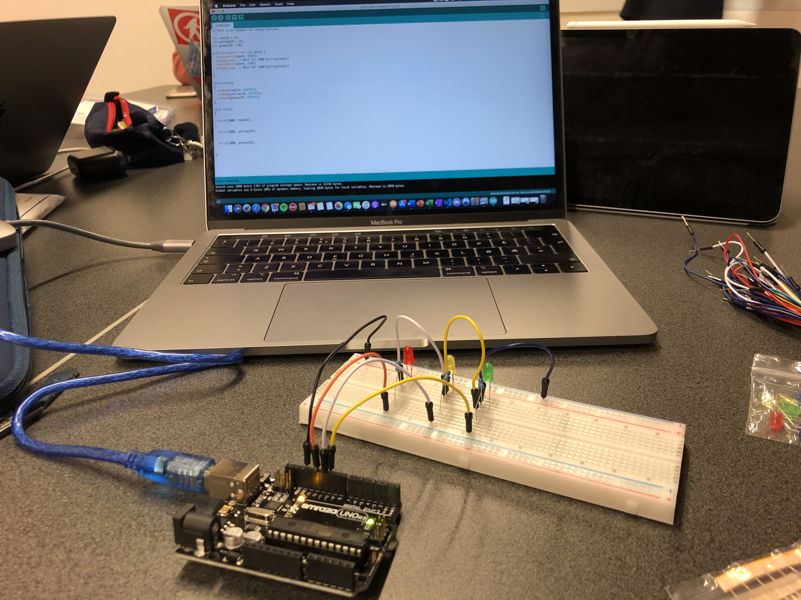
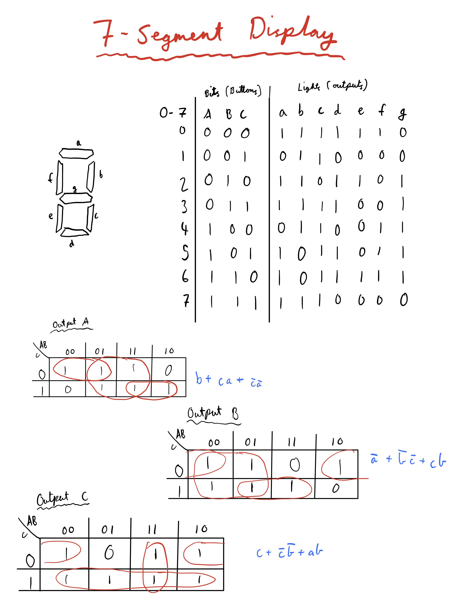
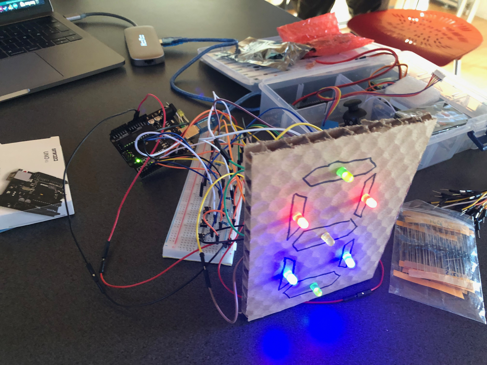
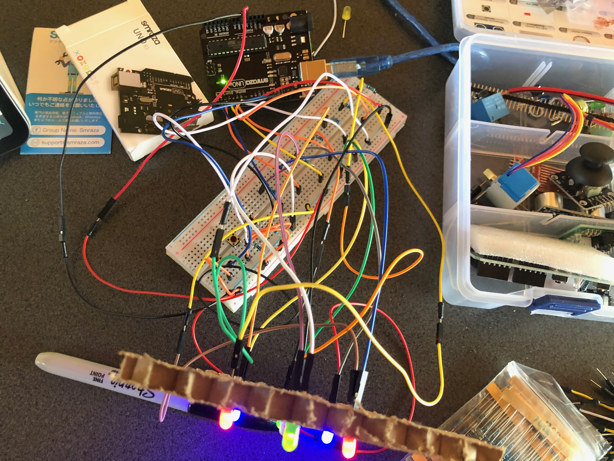
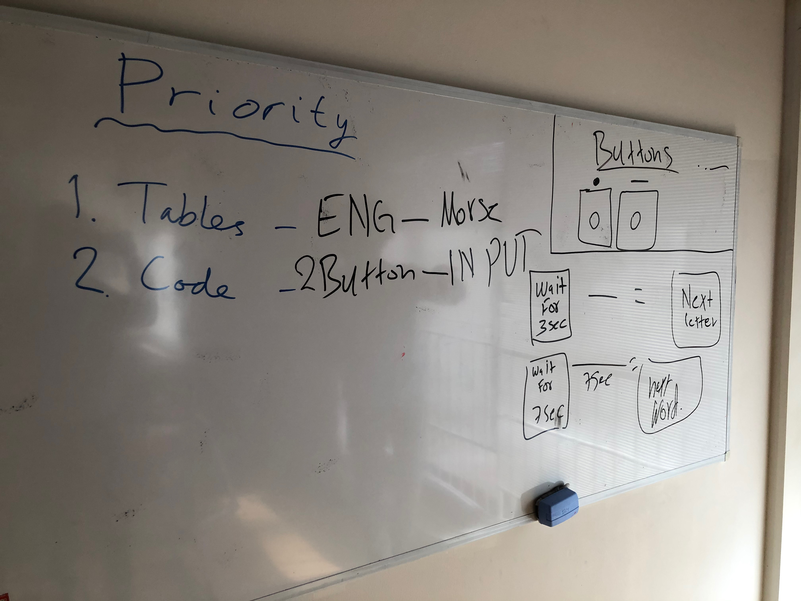
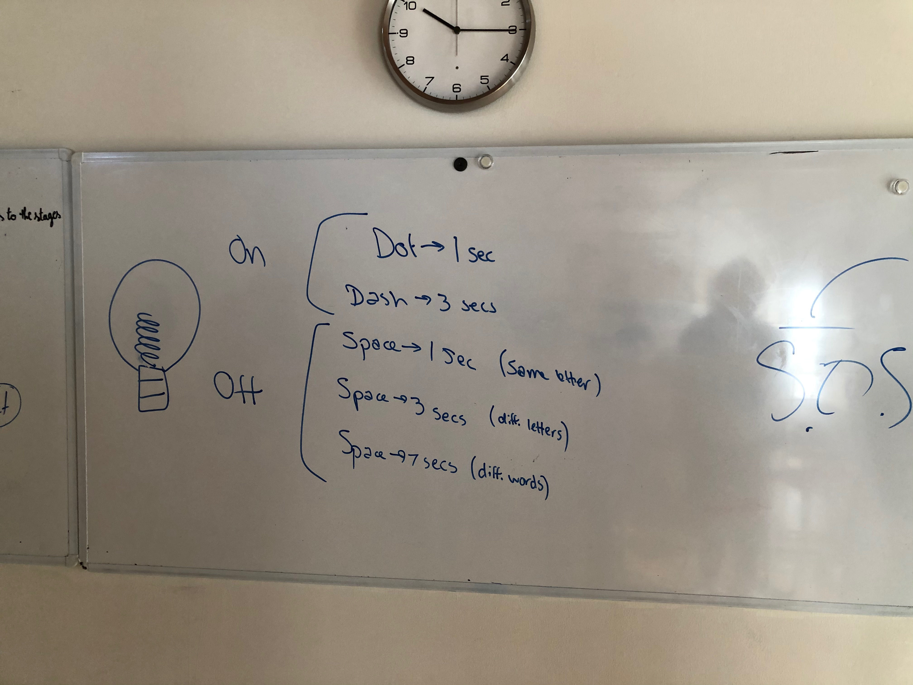

## Journal for Alexander N

Mon. 4. Nov
------------------
### Tasks done
* Introduced to the context of the problem
* Made repository
* Introduced to arduino (and tinkercad.com)

### To-do
* Understand how LCD screens work (arduino)
* Develop a program where the user can select letters from the alphabet with two buttons

### What did i learn
* How to use tinkercad.com, and thus arduino too
* Arduino wiring and general structure
* Brief C syntax

### Questions
* How would one display text on the LCD screen?
* In regards to the project, would it not be more convenient using radio communication? (if there are strong enough antennas)

Thu. 7. Nov
------------------
### Evaluation/comparison of bash and arduino programming languages

As most programming languages, bash and the arduino (C) programming languages have many similarities and differences. There are plenty of pros and cons for both. For example, **bash** is highly useful for scripting, that is running code directly from the terminal to perform simple and repetitive tasks. This high level of integration in the terminal gives the user alot of control over the system being used. Bash also has a rich collection of tutorials and examples online, because it is so widely adopted. However, bash's syntax is quite unsatisfactory. It is rather unnecessarily complicated which often leads to errors for small mistakes of little relevance. **The C programming language**, on the other hand, also has its pros and cons. First of all, I must mention that C has almost become an industry standard, with it being recommended that every professional programmer has a good understanding of the language. The C language is also a bit lower level, meaning that it is closer to the computer hardware. That means that the programmer is required to deal with and learn about the low-level workings of a computer (memory management, pointers, etc.) Also, C is very portable between hardware, meaning your code can work on many different systems with ease. It's relative simplicity and longevity have lead to it being very optimized and fast too. However, it is not nearly as simple syntax-wise compared to other very high level languages.

**In conclusion**, both these languages have many strong and weak sides. And frankly, it is qutie hard to compare because they serve different purposes, with bash being a shell environment and C being a common and widespread programming language. Both function very well for their intended tasks, given that the programmer overcomes the learning barrier in regards to the syntax required. If I was to recommend one language to learn, it would definitely be C because of its widespread use, in addition to the great experience you gain that is easily applied to other computational languages and tasks.

Mon. 11. Nov
------------------
### Tasks done
* Buildt a trafic light with the arduino (see picture below)

### To-do
* Learn about C variables
* Research binary theory

### What did i learn
* Wiring and mechanical engineering
* Uploading and configuring the arduino

### Questions
* None

Traffic light w/ arduino:


Wed. 13. Nov
------------------
### Tasks done
* Created a binary counter for the arduino. The code used was as follows:
```.c 
// Condition for the first led
if (i % 2 != 0) {
  digitalWrite(led1, HIGH);
}
// Condition for the second led
if (i % 4 > 1) {
  digitalWrite(led2, HIGH);
}
// Condition for the third led
if (i % 8 > 3) {
  digitalWrite(led3, HIGH);
}
// Condition for the fourth led
if (i % 16 > 7) {
  digitalWrite(led4, HIGH);
}
// Condition for the fifth led
if (i % 32 > 15) {
  digitalWrite(led5, HIGH);
}
```
The important part here is how the output is decided, as can be seen in the conditionals in the if-statements required to count from 0 to 31 with binary. It is decided based on the remainder of the power of 2 after dividing by a specific value. For example:

If the remainder of the number divided by 2^1 is 1, the first light is on (the number is odd). 
If the remainder of the number divided by 2^2 is greater than 1 ((2^2)/2 - 1), the second light is on. 
If the remainder of the number divided by 2^3 is greater than 4 ((2^3)/2 - 1), the third light is on. 
And so forth.

### To-do
* Build a binary counter with the physical arduino

### What did i learn
* Binary theory
* How to convert integers to binary with C

### Questions
* None


Tue. 19. Nov
------------------
### Tasks done
* Practiced and learned about logic gates
* Greated an expression for various tables of binary inputs and outputs

### To-do
* Using logic gates to simplify the homework task (converting a table into light outputs)
* Create a visual representation of binary numbers with a 7-segment display

### What did i learn
* Theory of logic gates
* Practical use of logic gates
* Drawing diagrams for logic gates

### Questions
* None


Wed. 20. Nov
------------------
### Tasks done
* Practiced drawing diagrams for 
* Created table for 7-segment number display, both inputs and outputs
* Created a 7-segment display (7 lights for now) on tinkercad

Examples of the code (including logic gates) to controll the output are:
```.c
// Define the input from the buttons as simple variables
A = digitalRead(butA);
B = digitalRead(butB);
C = digitalRead(butC);

// Light A
if (B || (C && A) || (!C && !A) ) {
  digitalWrite(outA, HIGH);
} else {
  digitalWrite(outA, LOW);
}

// Light B
if (!A || (!B && !C) || (C && B)) {
  digitalWrite(outB, HIGH);
} else {
  digitalWrite(outB, LOW);
}

// Light C
if (C || (!C && !B) || (A && B)) {
  digitalWrite(outC, HIGH);
} else {
  digitalWrite(outC, LOW);
}
```

This pattern continues for all 7 lights. Full code on my tinkercad under the project name "Counting with binary using 7 segment display".

Below is the logic i used to both find the tables for the inputs/outputs, but also the K-map tables:



### To-do
* Build a real 7-segment display with arduino

### What did i learn
* More practically how to apply logic gates in code
* Creating equations of inputs using logic gates (creating K-map tables)

### Questions
* None


Thu. 21. Nov
------------------
### Tasks done
* Buildt a 7 segment display with arduino:



### To-do
* Troubleshoot an error in the code, resulting in wrong output for the number 7.
* Fix and sort out the wiring system

### What did i learn
* Wiring techinques and practice
* Why cable management is important (as can be seen on the image, it became really chaotic)

### Questions
* None


Fri. 22. Nov
------------------
### Tasks done
* Finished 7 segment display
** Troubleshooting complete, cables sorted and code fixed
* Worked on repo for unit 2

### To-do
* Use feedback from Dr. Pinzo to improve repo: Only use code snippets (of challenging concepts or things i learned), not full code for a program

### What did i learn
* The importance of cable management
* How to better include code in my repo (see feedback)

### Questions
* None

Mon. 25. Nov
------------------
### Tasks done
* Discussed the input method (2 buttons to english text)
* Created the registration og inputs with buttons on tinkercad

### To-do
* Conclude best strategy for letter choice
* Code and build prototype, first with serial monitor as output then LCD display

### What did i learn
* How to cite sources on a repo
* About Human centered design
* Pros and cons of, and the choice between better usability vs efficiency

### Questions
* What should one prioritise for this project, usability and simplicity or efficiency and speed?

Mon. 2. Dec
------------------
### Tasks done
* Created table for every input symbol with corresponding binary values

### To-do
* Create a program that converts english symbols to binary (either with if tests or some other method)

### What did i learn
* 

### Questions
* How should we convert the characters to binary?
* Are there any premade functions for this?

Tue 10. Dec
------------------
### Tasks done
* Divided into separate groups for each individual station. My group is on the moon, including Khalid, Lydia and me.
* Divided tasks and priorities (see picture below)


* Researched and concluded on computational representation of morse code (see picture below)


### To-do
* Create program that converts binary input to english
* Create tables for english to morse
* Create presentation for CPU architecture in arduino and modern PC

### What did i learn
* Developed skills in planning and decision making. I feel like i took charge of the process of deciding priorities

### Questions
* None

Wed 11. Dec
------------------
### Tasks done
* Presented CPU architecture presentation
* Worked on program for binary to english conversion

### To-do
* Finish program

### What did i learn
* Interruptions
* String vs array in C
* Using a switch statement
* Problem solving (logical and syntax problems)

### Questions
* None

Thu 12. Dec
------------------
### Tasks done
* Completed binary to english system

### To-do
* 

### What did i learn
* 

### Questions
* What other programs do we need to make this a complete product?
* How do we combine all these programs to run as a single file on one arduino?
* ^ If not applicable, will we run several different interchangable sketches on the arduino?

Fri 13. Dec
------------------
### Tasks done
* Watched netflix documentary on coding - the past, present and future
* Introduced to IA assignment

### To-do
* Work on project over winter break

### What did i learn
* Eclectic programming languages
* Development and evolution of programming - from binary switches to machine learning
* Ethical implications of being a programmer

### Questions
* How broad should the IA be?
* What should the final result look like?


Mon 6. Dec
------------------
### Tasks done
* Refreshed outselves on the project
* Documented what tasks are done, and whats missing on a google doc

### To-do
* Integrate communication and input methods (blinking lights and pushing buttons)
* LCD Display?
* Assemble all the relevant finished programs on the individual arduinos

### What did i learn
* Importance of planning

### Questions
* Will we use the LCD display?

Wed 8. Dec
------------------
### Tasks done
* Worked on programming practice tasks in C (see folder in repository)

### To-do
* 

### What did i learn
* Syntax of C
* Computational thinking

### Questions
* What sort of applications is C good for?


