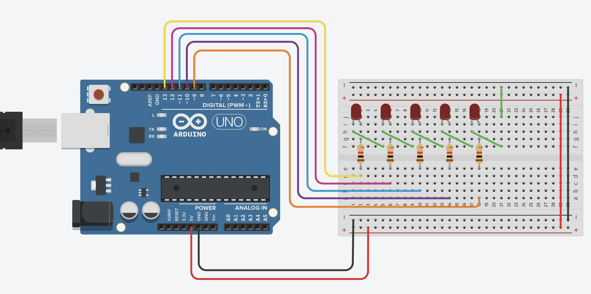

## Journal for Alexander N

Mon. 4. Nov
------------------
### Tasks done
* Introduced to the context of the problem
* Made repository
* Introduced to arduino (and tinkercad.com)

### To-do
* Understand how LCD screens work (arduino)
* Develop a program where the user can select letters from the alphabet with two buttons

### What did i learn
* How to use tinkercad.com, and thus arduino too
* Arduino wiring and general structure
* Brief C syntax

### Questions
* How would one display text on the LCD screen?
* In regards to the project, would it not be more convenient using radio communication? (if there are strong enough antennas)

Thu. 7. Nov
------------------
### Evaluation/comparison of bash and arduino programming languages

As most programming languages, bash and the arduino (C) programming languages have many similarities and differences. There are plenty of pros and cons for both. For example, **bash** is highly useful for scripting, that is running code directly from the terminal to perform simple and repetitive tasks. This high level of integration in the terminal gives the user alot of control over the system being used. Bash also has a rich collection of tutorials and examples online, because it is so widely adopted. However, bash's syntax is quite unsatisfactory. It is rather unnecessarily complicated which often leads to errors for small mistakes of little relevance. **The C programming language**, on the other hand, also has its pros and cons. First of all, I must mention that C has almost become an industry standard, with it being recommended that every professional programmer has a good understanding of the language. The C language is also a bit lower level, meaning that it is closer to the computer hardware. That means that the programmer is required to deal with and learn about the low-level workings of a computer (memory management, pointers, etc.) Also, C is very portable between hardware, meaning your code can work on many different systems with ease. It's relative simplicity and longevity have lead to it being very optimized and fast too. However, it is not nearly as simple syntax-wise compared to other very high level languages.

**In conclusion**, both these languages have many strong and weak sides. And frankly, it is qutie hard to compare because they serve different purposes, with bash being a shell environment and C being a common and widespread programming language. Both function very well for their intended tasks, given that the programmer overcomes the learning barrier in regards to the syntax required. If I was to recommend one language to learn, it would definitely be C because of its widespread use, in addition to the great experience you gain that is easily applied to other computational languages and tasks.

Mon. 11. Nov
------------------
### Tasks done
* Buildt a trafic light with the arduino (see picture below)

### To-do
* Learn about C variables
* Research binary theory

### What did i learn
* Wiring and mechanical engineering
* Uploading and configuring the arduino

### Questions
* None

Traffic light w/ arduino:


Wed. 13. Nov
------------------
### Tasks done
* Created a binary counter for the arduino. The code used was as follows:
```.c
// Ports for the different LEDs
// Counted from the right -> left
int led5 = 13;
int led4 = 12;
int led3 = 11;
int led2 = 10;
int led1 = 9;

void setup()
{
  Serial.begin(9600);
  pinMode(13, OUTPUT);
  pinMode(12, OUTPUT);
  pinMode(11, OUTPUT);
  pinMode(10, OUTPUT);
  pinMode(9, OUTPUT);
}

int i = 1;

void loop()
{
  for (i=1; i<=31; i++) {
    Serial.print("Num: ");
    Serial.println(i);
    
    // Condition for the first led
    if (i % 2 != 0) {
      digitalWrite(led1, HIGH);
    }
    // Condition for the second led
    if (i % 4 > 1) {
      digitalWrite(led2, HIGH);
    }
    // Condition for the third led
    if (i % 8 > 3) {
      digitalWrite(led3, HIGH);
    }
    // Condition for the fourth led
    if (i % 16 > 7) {
      digitalWrite(led4, HIGH);
    }
    // Condition for the fifth led
    if (i % 32 > 15) {
      digitalWrite(led5, HIGH);
    }
    
    // Resets everything
    delay(1000);
    digitalWrite(led1, LOW);
    digitalWrite(led2, LOW);
    digitalWrite(led3, LOW);
    digitalWrite(led4, LOW);
    digitalWrite(led5, LOW);
    delay(300);
    
  }
  // Delay 3 sec before next counting
  delay(3000);
}
```
The wiring of the arduino for this problem is as follows:



### To-do
* Build a binary counter with the physical arduino

### What did i learn
* Binary theory
* How to convert integers to binary with C

### Questions
* None


